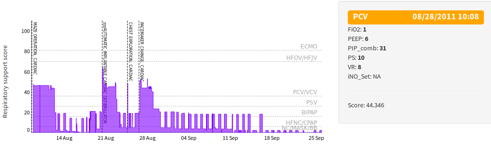
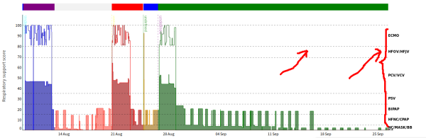

# BCH_dygraph_plugins
Highly customized and targeted dygraphs.js plugins developed for BCH. Runs with dygraphs v1.1.1 in R Shiny

Under construction.

##Basic usage:
1. Source the R file, e.g. `source("BCH_dygraph_plugins/rstlegend.r")`
2. Apply respective function on a dygraph:
  `dygraph_obj %>% dyRSTLegend(data)`

## rstlegend
* R source: rstlegend.r
* R function: dyRSTLegend
* Arguments:
  * divId: id of a div to push rst legend in, format: with no '#' prepended
  * buttonDivId: id of a div to put button in, format: with no '#' prepended
  * data: a R data.frame containing RSV columns with an additional "time" column

## timediff
* R source: timediff.r
* R function: dyTimediff
* Arguments:
  * data: a R data.frame with columns: "label", "time", "abbreviation", "style".

## locations (banner)
* R source: locations.r
* R function: dyLocations
* Arguments:
  * data: a R data.frame with columns: "label", "color", "start" and "end"

## ylimits
* R source: ylimits.r
* R function: dyYLimits
* Arguments:
  * data: a R data.frame with columns: "LB", "UB" and "label"

## colorundercurve
* R source: colorundercurve.r
* R function: dyColorUnderCurve
* Arguments:
  * data: a R data.frame with columns: "start", "end" and "color"
  "start", "end" need to be a number indicating seconds since Unix epoch.

## utildiv
* R source: utildiv.r
* R function: dyUtilDivs
* Arguments:
  * upper: id to assign to upper panel, format: with no '#' prepended
  * right: id to assign to right panel, format: with no '#' prepended
  * hover: id to assign to hover panel, format: with no '#' prepended

## unzoom
* R source: unzoom.r
* R function: dyUnzoom
* Arguments:
  * divId: id of div to put the unzoom button in, format: with no '#' prepended

